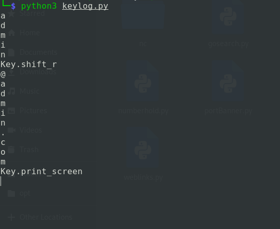
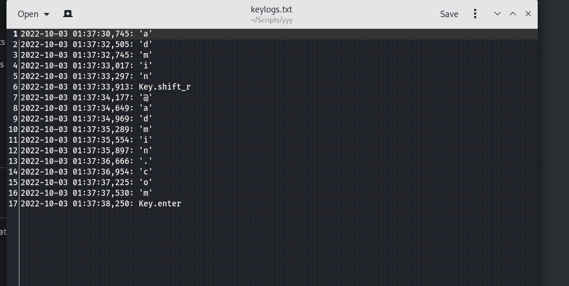

# Simple-Py-Keylogger
A simple python keylogger to capture ALL keystrokes pressed on the  keyboard.

-This script captures all strokes on targets machine and saves them locally as `keylogs.txt` with time stamp.

-To run this script run `python3 keylogger.py` to start capturing key-logs.

-Logs saves as:

### This Script should be modified to make it perform more functionalities ie:

*Connect it to remote listener/Server*

*Capture ScreenShoots*

**contact for more info**
